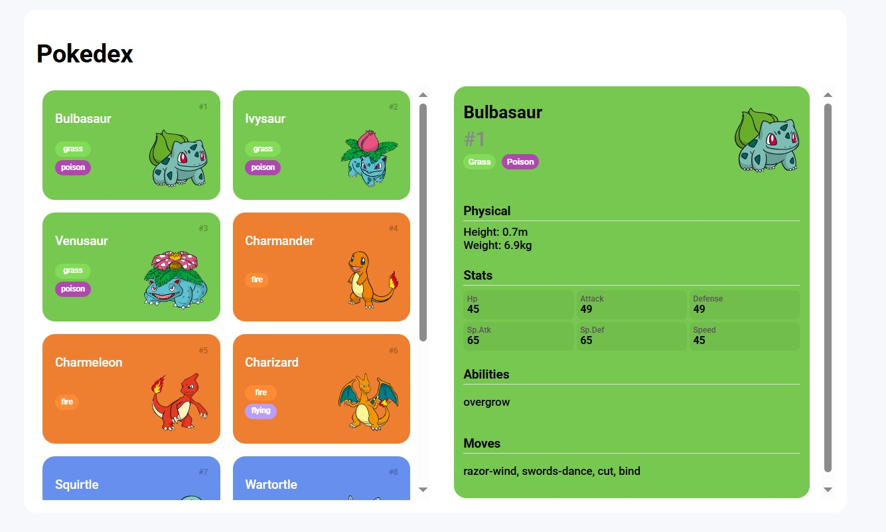
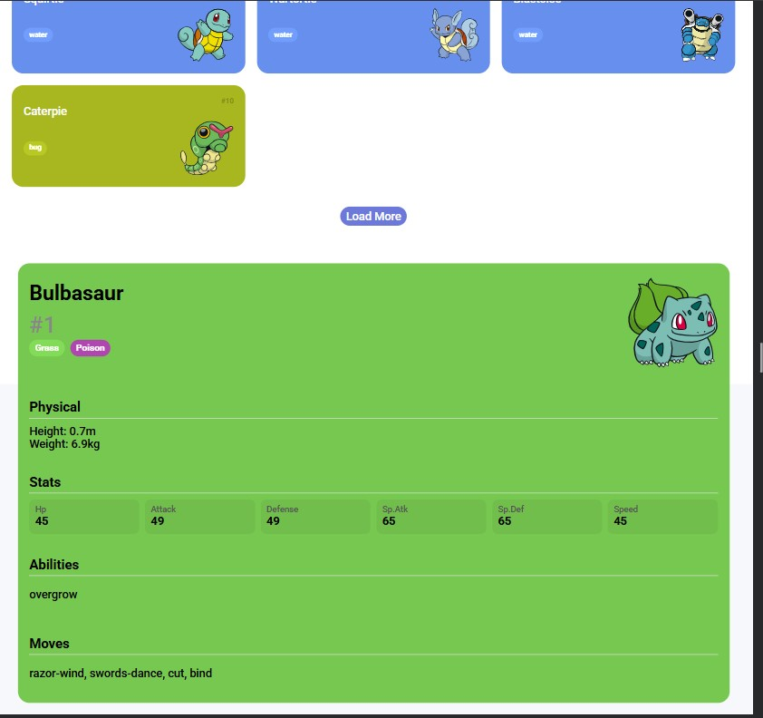
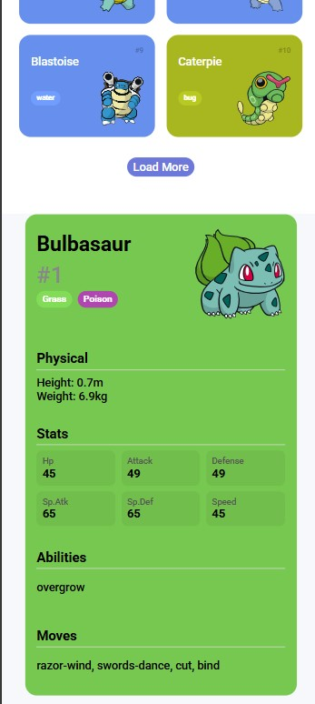

# Pokedex - Projeto JavaScript

## Descrição
Este projeto é uma Pokedex interativa desenvolvida com JavaScript puro, HTML e CSS. Ela consome a PokeAPI para exibir informações detalhadas sobre os Pokémon, incluindo estatísticas, habilidades, tipos e movimentos. O layout é responsivo e utiliza uma abordagem de duas colunas para melhor visualização.

## Capturas de Tela

### Versão Desktop


### Versão para Tablet


### Versão para Smartphone


## Tecnologias Utilizadas
- HTML5
- CSS3
- JavaScript Vanilla
- Fetch API para consumo de dados
- Responsividade com Media Queries
- Layout Flexbox e Grid

## Funcionalidades
- Lista paginada de Pokémon
- Visualização detalhada de cada Pokémon em um card lateral
- Dados exibidos: 
  - Nome e número
  - Imagem
  - Tipos
  - Estatísticas (HP, Ataque, Defesa, etc.)
  - Altura e peso
  - Habilidades
  - Movimentos

## Processo de Desenvolvimento

### Passo 1: Estruturação do Projeto
Criamos a estrutura básica do projeto seguindo uma arquitetura MVC:
- Modelo: Classe Pokémon
- Serviço: API para consumo de dados
- Visualização: HTML e CSS para renderizar os dados

### Passo 2: Consumo da API
Implementamos a integração com a PokeAPI:
```javascript
pokeApi.getPokemons = (offset = 0, limit = 5) => {
    const url = `https://pokeapi.co/api/v2/pokemon?offset=${offset}&limit=${limit}`
    return fetch(url)
        .then((response) => response.json())
        .then((jsonBody) => jsonBody.results)
        .then((pokemons) => pokemons.map(pokeApi.getPokemonDetail))
        .then((detailRequests) => Promise.all(detailRequests))
}
```

### Passo 3: Modelo de Dados
Criamos uma classe Pokémon para mapear os dados da API:
```javascript
class Pokemon {
    number;
    name;
    type;
    types = [];
    photo;
    height;
    weight;
    status = {};
    moves = [];
    abilities = [];
}
```

### Passo 4: Convertendo Dados da API
Implementamos a função para converter os dados da API para o nosso modelo:
```javascript
function convertPokeApiDetailToPokemon(pokeDetail) {
    const pokemon = new Pokemon()
    pokemon.number = pokeDetail.id
    pokemon.name = pokeDetail.name
    pokemon.types = pokeDetail.types.map((typeSlot) => typeSlot.type.name)
    pokemon.type = pokemon.types[0]
    pokemon.photo = pokeDetail.sprites.other.dream_world.front_default
    pokemon.height = pokeDetail.height
    pokemon.weight = pokeDetail.weight
    pokemon.status = pokeDetail.stats.reduce((stats, stat) => {
        stats[stat.stat.name] = stat.base_stat
        return stats
    }, {})
    pokemon.abilities = pokeDetail.abilities
        .filter(ability => !ability.is_hidden)
        .map(ability => ability.ability.name)
    pokemon.moves = pokeDetail.moves
        .slice(0, 4)
        .map(move => move.move.name)
    return pokemon
}
```

### Passo 5: Renderização da Lista de Pokémon
Criamos a função para converter os dados do Pokémon em HTML e exibir na lista:
```javascript
function convertPokemonToLi(pokemon) {
    return `
        <li class="pokemon ${pokemon.type}" onclick="showPokemonDetails(${pokemon.number})">
            <span class="number">#${pokemon.number}</span>
            <span class="name">${pokemon.name}</span>
            <div class="detail">
                <ol class="types">
                    ${pokemon.types.map((type) => `<li class="type ${type}">${type}</li>`).join('')}
                </ol>
                
            </div>
        </li>
    `
}
```

### Passo 6: Implementação do Layout de Duas Colunas
Modificamos o HTML para criar um layout dividido:
- Lista de Pokémon à esquerda
- Card de detalhes à direita


### Passo 7: Exibição de Detalhes do Pokémon
Implementamos a função para exibir os detalhes de um Pokémon ao clicar:
```javascript
function showPokemonDetails(pokemonId) {
    pokeApi.getPokemonById(pokemonId).then((pokemon) => {
        pokemonDetailsCard.innerHTML = `
            <div class="pokemon-detail-view ${pokemon.type}">
                <div class="pokemon-detail-header">
                    <div>
                        <h2 class="pokemon-detail-name">${pokemon.name}</h2>
                        <span class="pokemon-detail-number">#${pokemon.number}</span>
                        <div class="pokemon-detail-types">
                            ${pokemon.types.map((type) => `<span class="type ${type}">${type}</span>`).join('')}
                        </div>
                    </div>
                    
                </div>
                
                <div class="pokemon-detail-info">
                    <!-- Conteúdo detalhado incluindo estatísticas, habilidades e movimentos -->
                </div>
            </div>
        `
    })
}
```

### Passo 8: Estilização e Responsividade
Adicionamos estilos CSS para:
- Cores específicas para cada tipo de Pokémon
- Layout responsivo que se adapta a diferentes tamanhos de tela
- Estilização dos cards e detalhes

Como pode ser visto nas imagens acima, o layout se adapta perfeitamente a diferentes dispositivos, desde smartphones até desktops.

### Passo 9: Paginação
Implementamos um botão "Load More" para carregar mais Pokémon:
```javascript
loadMoreButton.addEventListener('click', () => {
    offset += limit
    const qtdRecordsWithNexPage = offset + limit
    if (qtdRecordsWithNexPage >= maxRecords) {
        const newLimit = maxRecords - offset
        loadPokemonItens(offset, newLimit)
        loadMoreButton.parentElement.removeChild(loadMoreButton)
    } else {
        loadPokemonItens(offset, limit)
    }
})
```

## Como Executar o Projeto
1. Clone este repositório
2. Abra o arquivo index.html em um navegador moderno
3. Ou utilize uma extensão como "Live Server" no VS Code para iniciar um servidor local

## Estrutura do Projeto
```
js-developer-pokedex/
├── assets/
│   ├── css/
│   │   ├── global.css
│   │   └── pokedex.css
│   ├── images/
│   │   ├── pokedex-desktop.jpg
│   │   ├── pokedex-phone.jpg
│   │   └── pokedex-tablet.jpg
│   └── js/
│       ├── main.js
│       ├── poke-api.js
│       └── pokemon-model.js
├── index.html
└── README.md
```

## Aprendizados e Desafios
- Consumo de APIs RESTful com JavaScript puro
- Manipulação de promises e requisições assíncronas
- Implementação de layout responsivo com grid e flexbox
- Modelagem de dados para organização do código
- Tratamento de eventos e interatividade
- Adaptação da interface para diferentes dispositivos e tamanhos de tela

## Melhorias Futuras
- Adicionar sistema de busca por nome ou número
- Implementar filtros por tipo
- Adicionar mais detalhes como evoluções
- Criar tema claro/escuro
- Adicionar animações e transições

---

Projeto desenvolvido como parte do bootcamp de JavaScript Developer da DIO.
